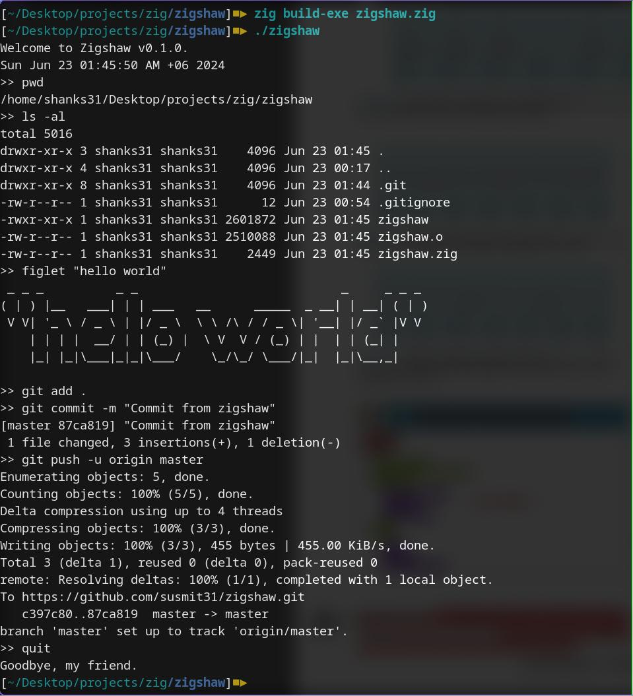

# Zigshaw
A simple "shell" written in Zig as a starter project to get a feel for the language.

# Usage
Don't think anyone else would be using this, but nonetheless documenting it here. Might write a shell script to automate this later on.

## Installation
```
git clone https://github.com/susmit31/zigshaw
cd zigshaw
zig build-exe zigshaw.zig
./zigshaw
```

# Screenshots

